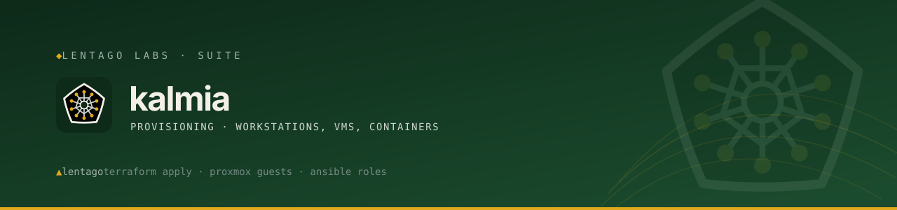

<!-- Lentago Labs brand header — generated by lentago/.github → brand/generate.py.
     Regenerate there; do not hand-edit the banner or badge URLs. -->
<a href="https://lentago.dev"></a>

[](https://github.com/lentago/kalmia/actions) [](https://github.com/lentago/kalmia/blob/main/LICENSE) [](https://deepwiki.com/lentago/kalmia)

  

# kalmia

**Kalmia** is the Lentago Labs provisioning system for workstations, VMs, and
containers. Today it is an Ansible rebuild of
[`workstation-bootstrap`](https://github.com/lentago/workstation-bootstrap) —
idempotent, role-based provisioning that turns a fresh Linux box into a fully
configured cloud-infrastructure dev workstation. Same toolchain, prompt, and
workflow across four targets, expressed as Ansible roles instead of
~1,000-line bash scripts. The scope will grow beyond workstations — VM and
container provisioning — as the Lentago lab's needs do.

**Authorship:** The Ansible code and documentation in this repo are co-written
with [Claude](https://claude.ai) (Anthropic). I direct the work and review the
output; Claude writes the code. I'm an infrastructure operator, not a software
engineer — please don't read this repo as a portfolio of coding ability.

## Why Ansible

The bash scripts worked, but every "is it already installed?" guard, the
marker-bounded `.bashrc` block, and the `((count++)) || true` traps were
hand-rolled idempotency. Ansible makes idempotency the module contract, models
the "80% shared / 20% per-platform" split as roles + variables, and
self-provisions a fresh box with one command.

## Targets (profiles)

| Profile | Target | Package manager |
|---|---|---|
| `xubuntu` | Xubuntu 24.04 (Proxmox VM) | apt |
| `ubuntu_laptop` | Ubuntu Desktop LTS (bare-metal laptop) | apt |
| `crostini` | Chromebook Crostini, legacy LXC container | apt |
| `baguette` | Chromebook ChromeOS M147+, containerless VM | apt |
| `fedora` | Fedora KDE (Proxmox VM) | dnf |

Both Chromebook profiles keep the `penguin` hostname, so autodetection splits
them on the LXC guest facts: legacy Crostini is an LXD container (Docker CLI
only), while Baguette is a crosvm KVM guest with systemd, cgroups v2, and
`/dev/kvm` — enough to run the full Docker Engine. ChromeOS does not
auto-upgrade existing installs, so both targets coexist.

## Quick start

> **Prerequisite:** the one-liner needs `curl`, and the clone path needs `git`.
> Both are present on a typical desktop install, but a minimal image may ship
> neither — `sudo apt install -y curl` (Debian/Ubuntu) or `sudo dnf install -y
> curl` (Fedora) first if so. `bootstrap.sh` installs everything else.

Self-provision a fresh box (installs Ansible, then runs the play):

```bash
curl -fsSL https://raw.githubusercontent.com/lentago/kalmia/main/bootstrap.sh \
  | WORKSTATION_PROFILE=xubuntu bash
```

Or from a clone:

```bash
git clone https://github.com/lentago/kalmia.git
cd kalmia
WORKSTATION_PROFILE=xubuntu ./bootstrap.sh
# …or, with Ansible already installed:
ansible-galaxy collection install -r requirements.yml
ansible-playbook site.yml -e workstation_profile=xubuntu
```

The profile autodetects from host facts when unset. Run a subset with tags, e.g.
`ansible-playbook site.yml --tags cli,shell`.

## How it works

- **Self-provisioning** against `localhost` (`connection: local`).
- **Profile + facts model**: `workstation_profile` selects `profiles/<name>.yml`
  (feature toggles like `docker_daemon`, `enable_tlp`);
  `ansible_os_family` selects `vars/<family>.yml` (package-name differences such
  as `batcat`↔`bat`). The toggles exist because the split isn't purely by
  distro — Crostini is Debian but daemonless; the Ubuntu laptop is Debian but
  the lone TLP power-management target.
- **Privilege model**: user context by default; system installs escalate with
  `become: true`; user config (nvm, `.bashrc`, Starship, VS Code settings) runs
  as you.

## Roles

| Role | Installs / configures |
|---|---|
| `common` | base packages, base services, global git config |
| `languages` | Python, Node.js (nvm), Go |
| `cloud_tools` | AWS CLI v2, Granted, Terraform (tfswitch), kubectl, eksctl, Helm |
| `containers` | Docker Engine + Compose (daemon optional) |
| `power` | TLP power management, ThinkPad charge thresholds, fwupd (opt-in) |
| `editors` | VS Code (+ extensions), Claude Code |
| `cli_tools` | jq, yq, bat, fd, ripgrep, fzf, tmux, direnv, Starship, … |
| `shell` | marker-managed `.bashrc` block + Starship config |
| `repos` | GitHub CLI + clone your repos (opt-in) |

## Status

**`xubuntu` and `fedora` are validated end-to-end** on clean Xubuntu 26.04 and
Fedora 44 VMs: a pristine box provisions with no failures and re-runs
idempotently, with the profile autodetected. Fedora installs the shared
toolchain plus Docker + VS Code from their dnf repos.

**`crostini` is validated end-to-end** on a Chromebook running Debian 13
trixie: same bar as the VMs. It runs Docker CLI-only (no daemon in the
container), with hostname-resolution and `~/.local/bin` fixes from the `common`
role.

**`baguette` is validated end-to-end** on a Chromebook running the
containerless VM under Debian 13 trixie: same bar as the others. ChromeOS
shipped the containerless VM in M143 behind
`chrome://flags#containerless-crostini`, then made it the default for new Linux
installs in M147 — which invalidates the `crostini` profile's daemonless
premise on upgraded Chromebooks. The hostname still matches, so the box would
silently get a Docker CLI with no daemon behind it. This profile runs the full
engine instead, and the first pristine run confirmed it: the profile
autodetected off the LXC guest facts and Docker Engine came up enabled and
active rather than CLI-only.

**`ubuntu_laptop` is proven idempotent on a provisioned host — a pristine
first-run is still unproven** (#14). It was run on a ThinkPad T14 Gen 2i
(Ubuntu 26.04, profile autodetected), converging from a
`workstation-bootstrap`-provisioned state rather than a clean image, not
from a pristine snapshot like the other profiles. Re-verified against merged
`main`, a live run reaches `ok=61 changed=0 failed=0`, and `--check`
completes (`ok=60 changed=2 failed=0`; the two changes are non-destructive
module artifacts tracked in #80). All nine roles ran, including `power`
(TLP, ThinkPad charge thresholds, fwupd) — exercised for the first time on
any profile.

## Beyond workstations

The first non-workstation target: `pub.yml` + the `pub` role codify the
Morning Brief publisher (rclone + systemd timer) running inside the `pub` LXC
(114). It's a standalone playbook, not a `site.yml` profile — see
[`docs/pub.md`](docs/pub.md) for how to run it and seed its secret.

The second: `lunaria.yml` + the `lunaria` role codify the wall-display
compositor (LXC 118) for **brasenia** (renamed from `lunaria` on 2026-07-20;
the legacy `lunaria` runtime names remain, rename tracked in #63 — see
[`docs/lunaria.md`](docs/lunaria.md)) — chromium-rendered Morning Brief →
ffmpeg → mediamtx HLS for the play-room Roku. Credential-free by design; the
guest itself is defined in `terraform/containers.tf`.

---

*Part of the [Lentago Labs](https://github.com/lentago) portfolio.*
