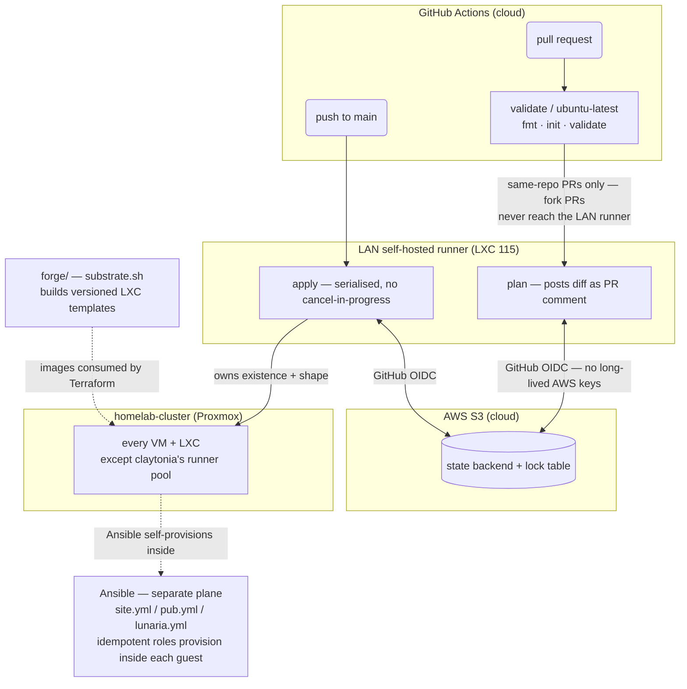

<!-- Lentago Labs brand header — generated by lentago/.github → brand/generate.py.
     Regenerate there; do not hand-edit the banner or badge URLs. -->
<a href="https://lentago.dev"></a>

[](https://github.com/lentago/kalmia/actions) [](https://github.com/lentago/kalmia/blob/main/LICENSE) [](https://deepwiki.com/lentago/kalmia)

  

# kalmia

**Kalmia** is the Lentago Labs provisioning system for workstations, VMs, and
containers. It has three layers, split by what they own:

- **Ansible** (repo root) — what's *inside* a machine's OS: idempotent,
  role-based workstation provisioning that turns a fresh Linux box into a
  configured dev workstation across five targets.
- **Terraform** ([`terraform/`](terraform/)) — which Proxmox guests *exist* on
  the homelab cluster. Terraform owns **every VM and LXC on the cluster** (bar
  one released to [claytonia](https://github.com/lentago/claytonia)), applied on
  merge from a LAN self-hosted runner.
- **Forge** ([`forge/`](forge/)) — the versioned machine *images* those guests
  are cut from.



> **Terraform plane:** merge to `main` is the deploy button. `plan` and `apply`
> run on the LAN self-hosted runner (LXC 115) because the Proxmox API is
> unreachable from GitHub-hosted runners; `apply` is serialised so two quick
> merges can't race on the same state. GitHub OIDC eliminates long-lived AWS keys
> for the S3 state backend. Fork PRs are blocked from the LAN runner by a
> same-repo guard in the workflow, reinforced by the repo's
> require-approval-for-outside-collaborators Actions setting. **Ansible plane:**
> independent — Terraform owns guest existence and shape; Ansible provisions
> inside them. **Forge:** `substrate.sh` produces versioned LXC templates that
> Terraform resources consume.

It supersedes the shell scripts in
[`workstation-bootstrap`](https://github.com/lentago/workstation-bootstrap):
same toolchain, prompt, and workflow, expressed as Ansible roles instead of
~1,000-line bash scripts.

**Authorship:** The Ansible code and documentation in this repo are co-written
with [Claude](https://claude.ai) (Anthropic). I direct the work and review the
output; Claude writes the code. I'm an infrastructure operator, not a software
engineer — please don't read this repo as a portfolio of coding ability.

## 📚 Ask this codebase (DeepWiki)

<a href="https://deepwiki.com/lentago/kalmia"></a>

> [DeepWiki](https://deepwiki.com/lentago/kalmia) maintains an AI-generated wiki
> over this repository — architecture pages, diagrams, and a Q&A box grounded in
> the actual code. Every public Lentago Labs repo is indexed
> ([deepwiki.com/lentago](https://deepwiki.com/lentago)); it is the fastest way
> to orient before reading source. It is AI-generated: trust it to orient you,
> verify against the code before you act on it.

**Good first questions:**

- How does kalmia's terraform apply avoid two concurrent merges racing on the
  same Proxmox state, and what runner executes the apply?
- What is the two-layer design of the forge runner image, and why does the
  software layer stay unbaked and always-main instead of pinned into the image?
- Which Ansible role or terraform resource currently still uses the legacy
  `lunaria` name, and what does issue
  [#63](https://github.com/lentago/kalmia/issues/63) track to complete the
  brasenia rename?

## 🧭 What this repo demonstrates

kalmia proves the same PR-gated, apply-on-merge model works for real
infrastructure — Proxmox VMs/LXCs and base OS images — that config repos use for
files. The patterns an IT-ops reader can lift wholesale:

| Pattern | How it shows up here |
|---|---|
| **Apply-on-merge Terraform via a LAN self-hosted runner** — merge *is* the deploy button, even for infra GitHub-hosted runners can't reach | [`terraform.yml`](.github/workflows/terraform.yml): `plan` posts the diff as a PR comment; `apply` runs on push to `main` from a LAN runner (LXC 115) because the Proxmox API is LAN-only |
| **Deadlock-safe required check via a synthetic `gate` job** — a required check whose workflow is path-filtered hangs PRs forever ("Expected" never resolves) | The [`gate`](.github/workflows/terraform.yml) job runs unconditionally and is the *only* context the ruleset requires; heavy jobs skip on docs-only PRs (skipped → green). See [lentago/.github#27](https://github.com/lentago/.github/issues/27) |
| **OIDC for the Terraform state backend** — no long-lived AWS keys in secrets | `terraform.yml` assumes `role/kalmia-github-actions-terraform` with `id-token: write`; least-privilege to this repo's S3 state key + lock table only |
| **Operational safety rails codified in IaC** — irreplaceable guests can't be destroyed by a bad plan | `lifecycle { prevent_destroy = true }` on the hardware-pinned HAOS VM (100) in [`terraform/vms.tf`](terraform/vms.tf) |
| **Two-layer image build pipeline (forge)** — versioned base images with a clear ownership boundary | [`forge/`](forge/README.md): kalmia owns the OS substrate ([`runner/substrate.sh`](forge/runner/substrate.sh)); the software layer is referenced from claytonia, not copied — script + `pct` capture over Packer, [rationale documented](forge/runner/README.md) |
| **Shared, org-wide reusable workflows** — one fix propagates fleet-wide | [`docs-check.yml`](.github/workflows/docs-check.yml) and [`shellcheck.yml`](.github/workflows/shellcheck.yml) are thin wrappers over `lentago/shared-workflows/.github/workflows/*.yml@main` |
| **Branch protection as policy, not habit** — change can't land without green CI, merge method constrained | The `main` ruleset requires squash-only merges + four checks (`gate`, `ansible-lint`, `shellcheck`, `docs-check`); see [Workflow](#status) |
| **Idempotent, role-based provisioning across heterogeneous targets** — the everyday config-management pattern | Five [profiles](#targets-profiles) share one role set; [`ansible-lint.yml`](.github/workflows/ansible-lint.yml) runs `--syntax-check` + `ansible-lint` on every PR |

**Architecture decisions:** The design choices behind these patterns — tool selection, profile routing, Terraform provider, apply-on-merge, capacity ownership, image forge tooling — are recorded in [`docs/adr/`](docs/adr/).

## 🛠️ Make a change yourself

This is a lab — the systems are real, the stakes are not. Pick a vector:

**Stand up a purpose-built container via Terraform.** Add a
`proxmox_virtual_environment_container` resource to
[`terraform/containers.tf`](terraform/containers.tf) (and, if it needs
configuring, a matching Ansible role/playbook), then open a PR. `plan` runs on
the LAN runner and posts the diff as a PR comment; once you merge to `main`,
`apply` runs automatically and the guest exists on the cluster — no manual
`pct`/`qm` commands.
**Proof this works:** [#59 — lunaria: wall-display compositor LXC (terraform
guest + provisioning role)](https://github.com/lentago/kalmia/pull/59).

**Build and ship a purpose-built machine image (forge).** Add or edit a forge
recipe under [`forge/<class>/`](forge/) — the OS-level `substrate.sh` — document
the image contract in its README, and run `build.sh` to produce a versioned LXC
template that Terraform consumes elsewhere. The PR captures both the recipe and
the rationale. (Forge ships exactly one image class today — `runner`, for
claytonia; the other classes in the forge README are roadmap, not yet built.)
**Proof this works:** [#42 — Image forge + first artifact: the claytonia-runner
LXC template](https://github.com/lentago/kalmia/pull/42) and [#43 — Docs: the
runner image is consumed, not a pending
follow-up](https://github.com/lentago/kalmia/pull/43).

**Harden the CI pipeline against a gating deadlock.** Edit
[`.github/workflows/terraform.yml`](.github/workflows/terraform.yml) to add an
unconditional `gate` job so the required status check always reports, then point
the branch ruleset at `gate` instead of the path-filtered jobs directly. The
merge activates the new gate immediately as policy. (Editing the ruleset needs
org-admin permission; the workflow edit itself is an ordinary PR.)
**Proof this works:** [#41 — Always run terraform CI on PRs, gate merges on a
`gate` check](https://github.com/lentago/kalmia/pull/41).

**Move capacity ownership across repos cleanly.** Remove a resource block from
kalmia's `terraform/` in one PR, coordinated with the receiving repo importing
the same guests into its own state in a paired PR. Apply-on-merge in each repo
takes over exactly the resources it now owns — no live guest is ever recreated.
**Proof this works:** [#40 — Release the bullpen runner pool from the guest
layer — capacity moves to claytonia](https://github.com/lentago/kalmia/pull/40).

---

The rest of this README documents the Ansible workstation layer — the oldest and
most-validated part of kalmia.

## Why Ansible

The bash scripts worked, but every "is it already installed?" guard, the
marker-bounded `.bashrc` block, and the `((count++)) || true` traps were
hand-rolled idempotency. Ansible makes idempotency the module contract, models
the "80% shared / 20% per-platform" split as roles + variables, and
self-provisions a fresh box with one command.

## Targets (profiles)

| Profile | Target | Package manager |
|---|---|---|
| `xubuntu` | Xubuntu 24.04 (Proxmox VM) | apt |
| `ubuntu_laptop` | Ubuntu Desktop LTS (bare-metal laptop) | apt |
| `crostini` | Chromebook Crostini, legacy LXC container | apt |
| `baguette` | Chromebook ChromeOS M147+, containerless VM | apt |
| `fedora` | Fedora KDE (Proxmox VM) | dnf |

Both Chromebook profiles keep the `penguin` hostname, so autodetection splits
them on the LXC guest facts: legacy Crostini is an LXD container (Docker CLI
only), while Baguette is a crosvm KVM guest with systemd, cgroups v2, and
`/dev/kvm` — enough to run the full Docker Engine. ChromeOS does not
auto-upgrade existing installs, so both targets coexist.

## Quick start

> **Prerequisite:** the one-liner needs `curl`, and the clone path needs `git`.
> Both are present on a typical desktop install, but a minimal image may ship
> neither — `sudo apt install -y curl` (Debian/Ubuntu) or `sudo dnf install -y
> curl` (Fedora) first if so. `bootstrap.sh` installs everything else.

Self-provision a fresh box (installs Ansible, then runs the play):

```bash
curl -fsSL https://raw.githubusercontent.com/lentago/kalmia/main/bootstrap.sh \
  | WORKSTATION_PROFILE=xubuntu bash
```

Or from a clone:

```bash
git clone https://github.com/lentago/kalmia.git
cd kalmia
WORKSTATION_PROFILE=xubuntu ./bootstrap.sh
# …or, with Ansible already installed:
ansible-galaxy collection install -r requirements.yml
ansible-playbook site.yml -e workstation_profile=xubuntu
```

The profile autodetects from host facts when unset. Run a subset with tags, e.g.
`ansible-playbook site.yml --tags cli,shell`.

## How it works

- **Self-provisioning** against `localhost` (`connection: local`).
- **Profile + facts model**: `workstation_profile` selects `profiles/<name>.yml`
  (feature toggles like `docker_daemon`, `enable_tlp`);
  `ansible_os_family` selects `vars/<family>.yml` (package-name differences such
  as `batcat`↔`bat`). The toggles exist because the split isn't purely by
  distro — Crostini is Debian but daemonless; the Ubuntu laptop is Debian but
  the lone TLP power-management target.
- **Privilege model**: user context by default; system installs escalate with
  `become: true`; user config (nvm, `.bashrc`, Starship, VS Code settings) runs
  as you.

## Roles

| Role | Installs / configures |
|---|---|
| `common` | base packages, base services, global git config |
| `languages` | Python, Node.js (nvm), Go |
| `cloud_tools` | AWS CLI v2, Granted, Terraform (tfswitch), kubectl, eksctl, Helm |
| `containers` | Docker Engine + Compose (daemon optional) |
| `power` | TLP power management, ThinkPad charge thresholds, fwupd (opt-in) |
| `editors` | VS Code (+ extensions), Claude Code |
| `cli_tools` | jq, yq, bat, fd, ripgrep, fzf, tmux, direnv, Starship, … |
| `shell` | marker-managed `.bashrc` block + Starship config + the `pull-all` / `clean-all` / `gh-issue` helpers |
| `repos` | GitHub CLI + clone your personal and org repos into `~/repos/<owner>/<name>` (on by default) |

## Status

**`xubuntu` and `fedora` are validated end-to-end** on clean Xubuntu 26.04 and
Fedora 44 VMs: a pristine box provisions with no failures and re-runs
idempotently, with the profile autodetected. Fedora installs the shared
toolchain plus Docker + VS Code from their dnf repos.

**`crostini` is validated end-to-end** on a Chromebook running Debian 13
trixie: same bar as the VMs. It runs Docker CLI-only (no daemon in the
container), with hostname-resolution and `~/.local/bin` fixes from the `common`
role.

**`baguette` is validated end-to-end** on a Chromebook running the
containerless VM under Debian 13 trixie: same bar as the others. ChromeOS
shipped the containerless VM in M143 behind
`chrome://flags#containerless-crostini`, then made it the default for new Linux
installs in M147 — which invalidates the `crostini` profile's daemonless
premise on upgraded Chromebooks. The hostname still matches, so the box would
silently get a Docker CLI with no daemon behind it. This profile runs the full
engine instead, and the first pristine run confirmed it: the profile
autodetected off the LXC guest facts and Docker Engine came up enabled and
active rather than CLI-only.

**`ubuntu_laptop` is proven idempotent on a provisioned host — a pristine
first-run is still unproven** ([#14](https://github.com/lentago/kalmia/issues/14)).
It was run on a ThinkPad T14 Gen 2i (Ubuntu 26.04, profile autodetected),
converging from a `workstation-bootstrap`-provisioned state rather than a clean
image, not from a pristine snapshot like the other profiles. Re-verified against
merged `main`, a live run reaches `ok=61 changed=0 failed=0`, and `--check`
completes (`ok=60 changed=2 failed=0`; the two changes are non-destructive
module artifacts tracked in [#80](https://github.com/lentago/kalmia/issues/80)).
All nine roles ran, including `power` (TLP, ThinkPad charge thresholds, fwupd) —
exercised for the first time on any profile.

## Beyond workstations

The first non-workstation target: `pub.yml` + the `pub` role codify the
Morning Brief publisher (rclone + systemd timer) running inside the `pub` LXC
(114). It's a standalone playbook, not a `site.yml` profile — see
[`docs/pub.md`](docs/pub.md) for how to run it and seed its secret.

The second: `lunaria.yml` + the `lunaria` role codify the wall-display
compositor (LXC 118) for **brasenia** (renamed from `lunaria` on 2026-07-20;
the legacy `lunaria` runtime names remain, rename tracked in
[#63](https://github.com/lentago/kalmia/issues/63) — see
[`docs/lunaria.md`](docs/lunaria.md)) — chromium-rendered Morning Brief →
ffmpeg → mediamtx HLS for the play-room Roku. Credential-free by design; the
guest itself is defined in `terraform/containers.tf`.

The Terraform layer that declares these guests carries its own naming-debt
footnote: kalmia's state backend migrated to `solidago-tfstate-*` keys
(2026-07-08), so this repo's own state sits under a `solidago` prefix — an
artifact worth knowing about, not worth churning to fix.

---

🌱 **Lentago Labs** is a team learning lab — real systems, non-critical stakes,
modern operations patterns demonstrated in the open. Start at the
[org profile](https://github.com/lentago), and read this repo on
[DeepWiki](https://deepwiki.com/lentago/kalmia).

*Part of the [Lentago Labs](https://github.com/lentago) portfolio.*
